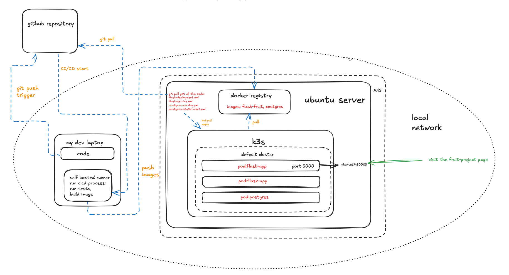

## Fruits_project start

#### Why this project?

My boyfriend and I are fruit lovers. We’ve tried a lot of fruits and recorded our experiences every time we tried a new one. The data was stored in an Excel file, but it became more and more complex (and didn’t look very nice), so I decided to create a program that includes a frontend, backend, database, to impletment the CRUD functions, and deploy it on our local network. Luckily, we have a NAS at home, which is perfect for the job.

Meanwhile, I want to apply all the skills I’ve learned and take my studies and hobbies to the next level by implementing this project. For me, it's a challenge to go through the entire DevOps process—from design to deployment and iteration—but I loooove challenges!

**Architecture Diagram**

### Plan:

*DB*:Postgres+SQLAlchemy

*Backend*:Python+Flask

*Frotend*: HTML+JINJA2+CSS(will change to JS + REACT for V2.0)

*Test*: Pytest(will be more for V2.0 after I learn more about test in my DevOps course)

*CI/CD*:Github actions(Must to try the pipline for interations as well! Even though I am the one-for-all team, I'm still agile)

*Deploy on*: Microk8S/minikube(The NAS couldn't hold it, so I decide to switch to k3s) on VM ubuntu on home NAS in local network

*Others*: Docker

### Dev log: 

**2025.01**

Gathered ideas and made the basic plan: decided on the tech stack, and designed the database structure based on the fruit's Excel file.
Read and learned the necessary theories according to the plan.

**2025.02.02**

DB has built
models.py has been added
on process of backend API...

**2025.02.07**

modified all endpoint as close as 'RESTFul'
add the to_dict func to all endpint Class

**2025.2.10**

Successfully linked the comment feature on the fruit detail page to users.
But I realized that the endpoint can't be RESTFUL becase I use reder template instead return json data. But to catch json I need to use JS to write fronten.
So I move to the task 'all endpints should be RESTFUL to V2.0', add study plan for JS after V1.0 deployed

**2025.2.12**

Checked the home NAS and deployment environment; the hardware supports virtual machines, and the memory is sufficient for MicroK8s.
Suddenly noticed log warnings—detected signs of DDoS attacks and something resembling SQL injection.
Shut down the server for inspection. After scanning all ports, found two unknown ports with no identifiable bound processes, and they couldn't be terminated with standard commands.
Since it was too late, decided to sleep first and investigate later.

**2025.2.13**

Enhanced NAS security measures, reconfigured the static IP address, and performed a full system scan.
On the router, disabled unnecessary features like AI-Cloud, reviewed all port forwarding rules, and found that the strange port 7788 had finally closed.
With security concerns addressed, decided to return to API development and adjustments.

**2025.2.15**

Give uo the directory related to the Place table in version 1.0 and moved it to a later version.

Spent a long time adjusting the relationship definitions between tables. first I took a shortcut by using backref, but this resulted in countless SAWarning messages. However, as the relationships became more complex, backref was no longer sufficient.

The difference between backref and back_populates is that the former requires definition on only one side and automatically creates the reverse relationship, while the latter must be manually defined on both sides.

**2025.2.17**

Started writing tests and setting up the necessary environment.
I discovered an issue: while the NAS has enough memory, the CPU is way too old. This means I have to push its limited performance to the extreme. (I really miss the time when I could do whatever I wanted during my free trial on Azure.)

So, I decided to install the minimal version of Ubuntu Server and configured it with a static IP.
At the same time, I give uo that using a pipeline to build images directly on the VM. Instead, I plan a alternative approach that is building the images on my loptop/or github sever(neend to figure out the way), pushing them to a Docker registry, and letting Kubernetes on the VM pull and deploy them.

**2025.2.18**

After setting up the VM, I ran into issues right on the first update attempt—it couldn’t connect to remote servers.
The IP and gateway configurations were correct, so I tried ping—only to realize that the mini version of the system didn’t have ping installed. I then tried apt, but it resulted in a dead loop because it couldn't reach remote servers.

Next, I attempted curl google.com and found that DNS resolution wasn’t working, though I could connect using an IP address.
After some investigation, I realized that the DNS nameserver wasn’t properly configured. I tried manually modifying /etc/resolv.conf using nano or vi, only to find out that neither nano nor vi were installed.

In the end, I updated the nameserver using echo, and the update finally succeeded... but I celebrated too soon.

After a reboot, the changes were lost because /etc/resolv.conf turned out to be a symlink. I had to delete the file, recreate it, and manually write in the nameserver. (Later, while installing Kubernetes, I ran into another DNS restriction issue with Google’s DNS and had to go through another round of trial and error before finally succeeding with Cloudflare’s DNS.)

Once again, I found myself missing the seamless cloud environment. LOL

Anyway, MicroK8s (the lightweight version) is now installed. I tested it with Nginx (and picked up some extra Nginx knowledge along the way), and everything works fine. Just need to install Docker for deployment, and that should be about it! 

**2025.2.20**

While writing tests, I found several key features related to reviews and user-fruit_list were missing, so I had to go back and fill in the gaps... I feel like my brain is running out of power 😭 not a good feeling that having to rework things halfway through testing! Lesson learned: if you underestimate the desgin part, then you'll end up with endless technical debt. But it's also frustrating when I suddenly get new ideas during development and want to make database-level changes...

I think learning JavaScript has become an urgent priority now. If I continue adding new features and relationships in the future, not following RESTful principles might cause big problems. 😂

**2025.2.23**

Been busy till midnight every day for the past two weeks, plus exams, kinda running on fumes. Pretty much passed out through the weekend without realizing it. Only had enough energy in the afternoon to finish writing the tests.

Learned something new: transaction—auto rollback is super convenient! At first, I tested directly with the database data, so the transaction didn’t trigger at all. Took me a while to realize I had to manually insert test data. Ended up clearing the database and rewriting the tests.

Got stuck on review_update for a bit. Couldn’t figure out why testing with numbers greater than 10 or less than 0 returned 302 instead of 404. Turns out I’d set min and max limits on the frontend. Since that’s the case, guess it’s fine to just rely on the frontend constraints.

Watching all the tests pass in the end—what a great feeling!

**2025.2.25**

During the final test, I found a critical bug!!!! I attempting to delete a comment ended up deleting another fruit. I spent a long time searching for the issue—there was nothing wrong with the cascade settings or the relationship tables, which left me puuuuuuuzzled for quite a while. Eventually, I found that the problem was caused by the routes: the URLs for deleting fruits and comments were almost identical. After fixing that, everything finally worked as expected.

**2025.2.26**

Fix the github secreats.Then upload the config class for comming cicd. 

**2025.03.03**

I went to a ski trip in Romania last week! It was amazing! This was my 2nd time to ski and I finished(fall 5 times) a blue slope hehe! 
I wrote a yml to tested the runner, then merge to main. Gonna do the cicd based on change of main. I also created the dockerfile and requirements.txt. 
On my way to write the cicd yml。
P.S learn a skill: to avoid trigger pipline with a commit(like update readme), use [skip ci] in commit message

**2025.03.05**

The day systemeticly study K8s. realized a question which I wondered long time: why K8S use ymal. APIserver, its you! Not because yml is easy to read, also because yml is superset of json and APIserver take REST request via HTTP from kubectl. Wonder why I didn't think of it before lol

**2025.03.07**

Created the necessary Kubernetes secrets in k8s to avoid exposing sensitive information due to the CI/CD pipeline running.

For DB deployment, I faced a choice: if I use k8s to creat the statefulset for DB deployment, which could affect alot of the already limited resources on NAS. But in the end, I decided to give it a try with strict resource limitations.

**2025.03.09**

Completed the necessary YAML files. I decided to first test the deployment of flask and Postgre. Once they are working, I will proceed with setting up Ingress for domain access.
finally I can test my pipeline!!

**2025.03.10**

The hell of errors!!!!! lol I think I encountered almost every possible Kubernetes deployment error.

First, to avoid exposing sensitive information in the CI/CD process, I used GitHub Secrets and Kubernetes Secrets. However, since I tagged my images using an IP address, I initially replaced the IP in the image name using GitHub Secrets. But Kubernetes couldn’t resolve it.

So, I switched to using Kubernetes Secrets and set them as environment variables. But even then, Kubernetes still couldn’t resolve its own secrets in the image name! Then I tried dynamically replacing the image name within the CI/CD pipeline… Finally, Kubernetes could fully parse the image name. But this was just the beginning…

Kubernetes crashed. I had to reinstall it to continue. lol

By default, Kubernetes doesn’t trust private registries and only pulls images over HTTPS. But since I pushed my images to a private registry after building them on my development laptop my CI/CD pipeline kept failing to pull the images. It just never worked.

The BackOffError nearly broke me. I modified the .toml file, explicitly declared HTTP in both the .toml and my Docker settings, and managed to pull images from Docker Hub. But after countless stop/start attempts with MicroK8s, it still couldn’t pull from my private registry.

So, sometimes CI/CD looked successful, but the pods couldn’t actually start. In the end, I had no choice but to use a complicated solution after hard tring google: using a self-signed certificate. I ended up going back to HTTPS, but at least I could finally pull images!

But I was happy too soon…

Kubernetes kept crashing. I couldn’t even open the logs. lol
Restarted, crashed again, and again, and again, again... (Sounds like the BackOffError always with a long tailed echo lol)

**2025.03.11**

I feel like an East Asian parent forcing my underpowered little kid to win an Olympic gold medal.

In the end, I had to face reality: My dear NAS is already old and should retire. MicroK8s is just too much for it.

I think I’ll take a step back and try switching to K3s instead.

**2025.03.12**

After countless rounds of debugging and trial and error, CI/CD finally worked! It finally worked! When I saw all three pods running healthily, I was so happy I almost cried—pure accomplishment filled me up! Now, I can type in the IP address and access my own project.

But… there’s a new issue: I can open the index page, but other pages throw a 500 error. Since the code passed unit tests and the probes check out fine, I’m guessing it’s because there’s no data in the database. I’ll debug it while importing the data. After that, I’ll set up Ingress and give my project a cute custom domain!

I’ll also take some time to document the specific issues I encountered, how I fixed them, and other important details, then upload everything as a tech doc in the repo.

(But first, I need a break. I’ve been debugging until midnight every day, and I just want to get some solid sleep. School has been intense too— studting AWS and Terraform which have been sitting on my to-do list for a while, and I really like them! I also need to renew my Azure cert before the end of the month. This month is seriously packed!)

**2025.03.15**

A Historic Day!

I reached out to an experienced industry professional today for advice on a problem I encountered after successfully deploying CI/CD. Everything except the index page on the frontend was returning a 500 status code. I got a lot of troubleshooting ideas from our discussion.

Since my CI/CD pipeline passed all unit tests in pytest and Kubernetes’ health checks, it meant the code was fine, and Flask was running normally. That meant the issue had to be with the database. Checking the PostgreSQL pod logs, I saw that the database connection was failing due to a password mismatch. But after triple-checking the credentials in my Kubernetes secrets, deleting and updating them again, and even logging into the PostgreSQL container manually—I was able to connect successfully. So, it wasn’t actually a password issue.

Next, I went into the Flask container to check the database URL. That’s when I realized the URL didn’t match what I expected. I had only set the username, password, and database name in Kubernetes secrets, thinking that would be enough to generate the URL automatically (rookie mistake!). I updated my secrets to include the full database URL, reran my CI/CD deployment, and checked again. This time, the URL was correct!

But... the frontend was still throwing 500 errors. Running Python inside the Flask container and manually accessing the /fruits route returned the same error. So, I exited the container and checked the pod logs. The logs showed the real issue—the fruits table didn’t exist in the database.

I immediately connected to the database, created all the necessary tables, and redeployed through CI/CD. Finally, everything worked! The frontend was fully functional, and my v1.0 version was successfully deployed. Not only that, but I now had a reusable CI/CD pipeline in place. The only thing left is importing data and getting the system into real use.

This was my first time completing a full-stack DevOps workflow from start to finish. I’ve learned so much—practical experience that no school course could ever teach. And that moment when everything finally worked after all the debugging, adjusting, that was pure joy and an incredible sense of achievement.

Next, I plan to do a full post-mortem analysis—documenting the entire execution process and troubleshooting steps. It’s going to be a big task. Considering I have exams, a group project at school, and an Azure certification update in the next two weeks, I’ll take it slowly.

**2025.04.01**

Started to work with the retro docs. was a bit sick and busy with school project last week, so took a slow step on this side. Checked the test file first (also because the official testing cource have been started this week, so want to have a bit sync effort), went through the thoeritical part include transcation and got the new/better way(tring to use mock to rewrite test and see the diffrence with use the real DB for test). Feels that really is a magical way to make the test process easier! 

**2025.04.07**

Went to the pink programmring's event yesterday and got a lot info about how can I build my github profile better! I guess now my profile is looks next level haha! 
Upload the doc "QLAlchemy Relationship Mapping Guide" about the SQLalchemy which based on my on experience of this project. I asked chatgpt to reform my own note and use the logic "in which order we need to think when we need to design and mapping the tables with SQLachemy", and som important key points when we implement it acording to 3 situations: many to many, one to many, many to one. Hope this note can help who is cofused and stacked in this part also.

**2025.04.08**

Got the chance to attend the ELISA workshop next month!
As a beginner in this field, I’m truly grateful to the ELISA community for giving me this opportunity to bring my questions and perspectives to people working deeply in safety and system reliability.
I’ll admit—I’m also feeling a little nervous.

Between reviewing my recent project and taking a course on software testing, I’ve started to gain a deeper understanding of the culture behind DevOps and DevSecOps.
I’ve also set up a time to sit down with a few Linux-enthusiast friends to really explore these ideas together.

**2025.04.11**

Today, I went back to my old school to discuss ELISA-related topics with some friends.
Our conversation ranged from trust mechanisms behind package managers to system-level stability.
By the end of it, I realized that many of our thoughts around safety actually stemmed from two distinct dimensions: external trust chains and internal intent chains.

Since everyone in the group prefers hands-on learning, I found the discussion incredibly insightful.
There were a few disagreements, though, which I think reflect broader concerns people have about open source.
For example, some expressed skepticism about the entire open source model, pointing out that it’s built on assumed trust—something that seems to contradict the principles of zero trust in security.
One person mentioned the real case where Russian hackers gained community trust and contributed malicious patches.
At first, that perspective made sense. But I also felt that rejecting open source altogether would mean throwing away too many valuable possibilities.

To me, the world is a complex system, and absolute certainty is rare.
Most of us aren’t working toward a perfect “0” or “1” outcome—but toward something that comes very close.
This whole reflection process helped me realize that what I want to build isn't just pipelines that run, but pipelines that hold up—pipelines that are stable and reliable by design.

In my own project, for example, once I started thinking from a security angle, I began noticing how each interaction between systems introduced new risk.
Even in a happy-path scenario, pipelines can contain hidden vulnerabilities simply because of how many systems are involved.
Unlike isolated scripts, CI/CD pipelines span multiple steps and environments—so if they’re only designed for the ideal case, they’re inherently fragile.

That’s why I’m looking forward to the ELISA workshop next month. I hope it will give me more tools and direction.

I also talked to some local DevOps engineers.
Compared to pure tech companies, many of them work in hybrid, more complex environments.
That makes pipeline robustness, traceability, and safety even more important than in a clean cloud-only setup.

These conversations were eye-opening.
Suddenly, the amount I need to learn feels exponential—but so does my sense of clarity and confidence about this career path.

### 📌 Challenges Encountered in Backend, Frontend, and Database Development📌 

**Database**

I love the design part especially to figure out entity and their relation. But the difficult part is to clarify the relations on SQLAlchemy model. I arranged a document/note that the logic chain can help to wright the relationship description on ORM model, and plan to open a new branch to put it(also maybe the comming note for other steps in project) 

**Backend API**

I used to use the Python Flask framework for my Python course, but this time integrated with a database, which led to learning about ORM and data modeling using SQLAlchemy.
In previous school projects, the endpoint requirements were provided by the instructors, and the number of endpoints was relatively small, so there were no major difficulties.
But this time, the project required designing endpoints, database structures, and relationship mappings based on self-defined requirements.
This felt like running blindfolded—I thought I had a good grasp theoretically, but in practice, I encountered many specific issues.
For example, school assignments did not involve ORM or how to use relationship tables to integrate objects and call them based on requirements. Debugging in these areas took a significant amount of time.

**Frontend**

The initial HTML pages were too ugly, and the "client" rejected them.
Eventually, the "client" took matters into their own hands and wrote a CSS template.

**Other Issues**

Got too focused on development and forgot to eat and sleep. 😅 
